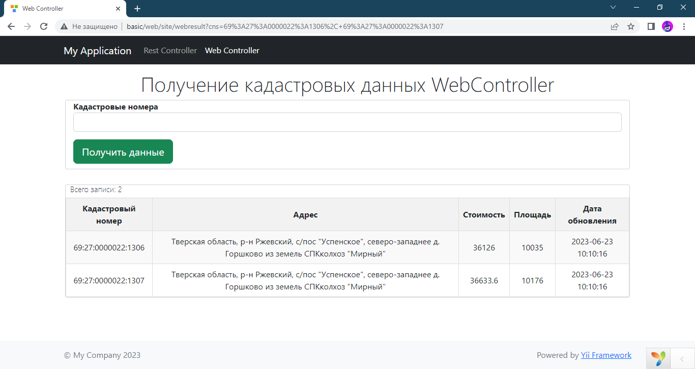

# Развертывание приложения

Этот репозиторий содержит исходный код и файлы, необходимые для развертывания и запуска приложения в среде продукции.

## Требования

- **PHP (версия 8.1)**
- **Веб-сервер (Apache или Nginx)**
- **СУБД (MySQL)**

## Установка

1. Клонируйте репозиторий:
   - **git clone https://github.com/WounderGrift/CadastrApi**

2. Установите зависимости:
   - **composer install**

3. В конфигурации db.php укажите данные вашей базы:
   - **dbname**
   - **username**
   - **password**
   
4. В консоли выполните в корне проекта выполните:
    - **php yii migrate**

# Использование компонента ApiComponent

Компонент ApiComponent предоставляет функциональность для работы с API и обработки данных,
связанных с кадастровыми номерами.

1. Установите фреймворк Yii и настройте его в своем проекте.

2. Подключите компонент ApiComponent в вашем коде:

```php use app\components\ApiComponent;```

3. Создайте экземпляр компонента похожим образом:

```php 
private $apiComponent;

public function __construct($id, $module, ApiComponent $apiComponent, $config = [])
{
    $this->apiComponent = $apiComponent;
    parent::__construct($id, $module, $config);
}
```

#### Методы

**`factory(string $cns): array`**

Метод `factory` принимает строку `$cns`, содержащую один или несколько кадастровых номеров, разделенных запятыми или пробелами. Он выполняет следующие действия:

- Разбивает строку на отдельные кадастровые номера.
- Инициализирует массивы для хранения результатов и номеров, требующих обновления.
- Итерирует по каждому кадастровому номеру:
    - Проверяет, существует ли запись в базе данных RusReestr с данным номером. Если запись отсутствует, номер добавляется в массив требующих обновления.
    - Если запись существует, проверяет, нужно ли ее обновить, основываясь на дате последнего обновления.
    - Если обновление не требуется, добавляет объект RusReestrDTO в массив результатов.
- Если есть номера, требующие обновления, вызывает метод getDataFromApi для получения данных от API.
- Обновляет существующие записи в базе данных и добавляет соответствующие объекты RusReestrDTO в массив результатов.
- Возвращает массив объектов RusReestrDTO.

#### `getDataFromApi(array $cns): array`

Метод `getDataFromApi` выполняет запрос к API, передавая список кадастровых номеров в качестве параметра. Он выполняет следующие действия:

- Создает экземпляр `yii\httpclient\Client` для выполнения HTTP-запросов.
- Создает GET-запрос к URL `https://api.pkk.bigland.ru/test/plots` с передачей данных в формате JSON.
- Получает ответ от API и проверяет его статус.
- Если ответ успешен, парсит данные и возвращает массив объектов `RusReestrDTO`.
- Если ответ не успешен, выбрасывает исключение `HttpException`.

#### Тестирование парсера

```php vendor/bin/codecept run unit CadastralNumberParserTest```

#### Запрос Веб контроллера

```http://basic/web/site/webresult?cns=69:27:0000022:1306, 69:27:0000022:1307```



#### Запрос консольного контроллера

```php yii console/get-data --cns=69:27:0000022:1306,69:27:0000022:1307```


#### Запрос curl

```
     curl --location 'http://basic/web/rest/get-data
     ?cns=69%3A27%3A0000022%3A1306%2C%2069%3A27%3A0000022%3A1307' \
     --header 'Content-Type: application/json' \
     --header 'Accept: application/json'
```


